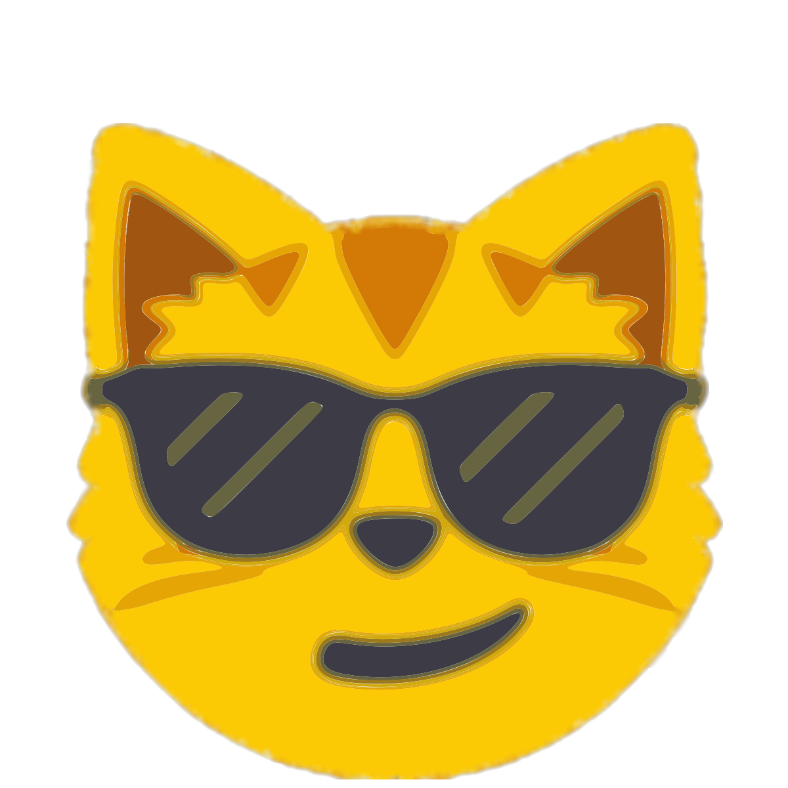

    

<h2 align="center">Hello, kind stranger 👋😳</h2>

    Someone who finds great pleasure in the art of Computer programming.
     

 

    

    

    

 

### About me

- Someone who started coding three years ago. 😳
- My first project was a slow running discord bot which didn't even have a good looking help command. 🤔
- And currently I'm working on Discord bots such as [reaction bot🎉](https://top.gg/bot/519287796549156864/) and [HNS OwO Counter](https://discord.gg/hns). 🎈

### Plans

- 😅 Tryna improve my coding skills of course!
- 🧠 Learning [Python](https://www.python.org/) 🐍 and [PHP](https://www.php.net) 🔵

### Current project(s)

- 🎉 adding redis and a better sharding manager to reaction bot
- 🐠 recoding Fish n Economy and Spaghetti bot

### Finished lately

- 🎈 added slash command to HNS OwO Counter

### Contact me at

- Discord: [`maxi#7777`](https://discord.bio/p/7777)
- Steam: [`maxi7777`](https://steamcommunity.com/id/maxi7777/)

### Bots

1)  [Reaction bot🎉](https://top.gg/bot/519287796549156864/) - OwO reminder, custom bot reminders.

2)  [Spaghetti Bot](https://top.gg/bot/585142238217240577) - You love quizzes, want a simple economy, and leveling system? This bot is for you!

3)  [Fish n Economy](https://top.gg/bot/486926264800903171) - Earn money by catching adorable fish and fighting other users.

### Servers

1) [Reaction bot🎉](https://discord.com/invite/KwfCk7r) - Official support server for [Reaction bot🎉](https://top.gg/bot/519287796549156864/).

2) [Fish n Economy](https://discord.com/invite/W5Zj3G2) - ~~Official support server~~ (bot offline).

3) [🤖🌍 Discord bot land](https://discord.com/invite/BaKUKUN) - Growing programming & bot community on Discord.
